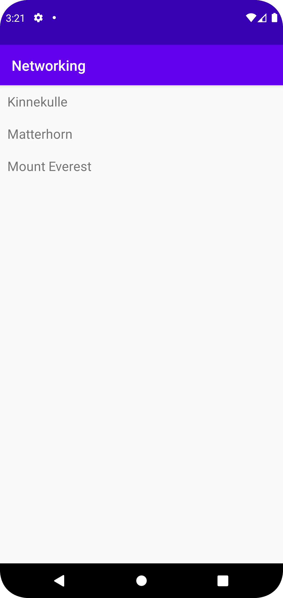

# Rapport


Jag har utvecklat ett webbprojekt på Android som inkluderar JSON-parsning, HTTP-förfrågningar och
RecyclerView-funktionsimplementering. Här är en sammanfattning av mitt arbete:
Jag skapade en JsonTask-klass för att utföra JSON-förfrågningar, konfigurera anslutningar och 
ta emot JSON-svar.
Jag implementerade JsonFile-klassen för att läsa JSON-data från lokal fil med InputStream och Scanner.
Jag utvecklade en RecyclerViewAdapter för att fylla RecyclerView med data. Den visar en lista 
över bergsobjekt och deras namn.
Jag skapade en Mountain-klass med egenskaper för id och namn, getter och setter metoder.
I MainActivity konfigurerade jag RecyclerView och hanterade processen att hämta JSON-data. 
Jag använde JsonTask och JsonFile för att få JSON-data från URL eller lokal fil.
Medan jag kör appen kör jag JsonFile för att läsa JSON-filen och visa bergsnamn i RecyclerView
med RecyclerViewAdapter.

Sammanfattningsvis demonstrerade mitt nätverksprojekt framgångsrikt JSON,
analyserade HTTP-förfrågningar och implementerade RecyclerView i en Android-applikation.
Programkod ska se ut som exemplet nedan. Koden måste vara korrekt indenterad då den blir lättare 
att läsa vilket gör det lättare att hitta syntaktiska fel.

```
 @NonNull
    @Override
    public ViewHolder onCreateViewHolder(@NonNull ViewGroup parent, int viewType) {
        layoutInflater = LayoutInflater.from(parent.getContext());
        View itemView = layoutInflater.inflate(R.layout.activity_recycler_view_item, parent, false);
        return new ViewHolder(itemView);
    }

    @Override
    public void onBindViewHolder(@NonNull ViewHolder holder, int position) {
        Mountain mountain = items.get(position);
        if (mountain != null) {
            holder.title.setText(mountain.getName());
        }
    }
```

Bilder läggs i samma mapp som markdown-filen.


